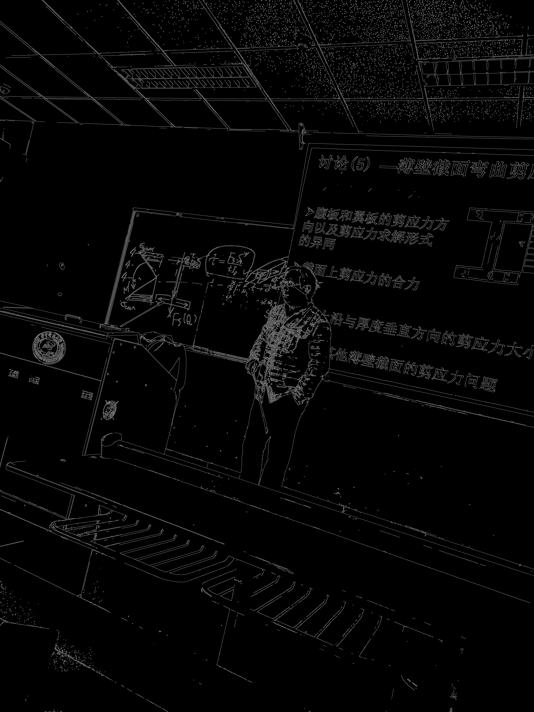

# 这是关于opencvx相关算法的测试代码

由于部分原因，部分代码（主要是关于SIFT、SUFT算法）需要将opencv版本回退至3.4.1之前，python版本回退至3.6之前。

## 1. SIFT算法

**sift算法**核心是构建一个SIFT描述子，然后对图像进行描述，描述子是一个特征点的坐标和方向，描述子的大小是固定的，是128维的。
这些描述子是通过SIFT算法计算出来的，SIFT算法的计算过程是：
首先，我们需要计算出图像的特征点keypoint，这些特征点通过构建图像金字塔得出，这些特征点为图像以及差分金字塔的极值点。
然后，我们需要计算出每个特征点的描述子，这些描述子是一个128维的向量，描述子的大小是固定的，是128维的。

```python
        import cv2
        import numpy as np
        img=cv2.imread('test.jpg',0)
        sift=cv2.xfeatures2d.SIFT_create()
        kp,des=sift.detectAndCompute(img,None)
        img=cv2.drawKeypoints(img,kp,None,flags=cv2.DRAW_MATCHES_FLAGS_DRAW_RICH_KEYPOINTS)
        cv2.imshow('sift',img)
        cv2.waitKey(0)
        cv2.destroyAllWindows()
```

## 2. SURF算法

**SUFT算法**是**sift算法**的改进版，其计算量较SIFT算法较小。由于SIFT算法已申请专利，较高版本已将其移除。


## 3. Canny算法(边缘检测)

边缘检测算法较为简单和基础，不作赘述


```python
        import cv2
        import numpy as np
        img=cv2.imread('test.jpg',0)
        canny=cv2.Canny(img,100,200)
        cv2.imshow('canny',canny)
        cv2.waitKey(0)
        cv2.destroyAllWindows()
```

## 4. Hurris算法(角点检测)

**Hurris算法**通过计算角点的梯度和方向，来检测角点。该算法计算偏移量矩阵M，通过计算该矩阵的特征值来判断其性质。若特征值大于阈值，则认为该点是角点。若特征值小于阈值，则认为该点不是角点。若两个特征值比值较大，则其为图像边缘。

```python
        import cv2
        import numpy as np
        src=cv2.imread('test.jpg',0)#以灰度读取图像
        corner=cv2.cornerHarris(src,2,3,0.04)#计算角点
        corner=cv2.threshold(corner,0.1*corner[1].max(),255,cv2.THRESH_BINARY)
```

其改进方法goodFeathersToTrack()主要区别再去判断方法不同，该方法判断方式为：当两个特征值均大于一定值是判断其为角点，只有一个大于阈值时判断其为边缘，当两个特征值均小于阈值时判断其为边缘。

```python
        import cv2
        import numpy as np
        src=cv2.imread('test.jpg',0)#以灰度读取图像
        corner=cv2.goodFeaturesToTrack(src,100,0.01,10)#计算角点
        corner=np.int0(corner)
        for i in corner:
            x,y=i.ravel()
            cv2.circle(src,(x,y),3,255,-1)
        cv2.imshow('corner',src)
        cv2.waitKey(0)
        cv2.destroyAllWindows()
```
