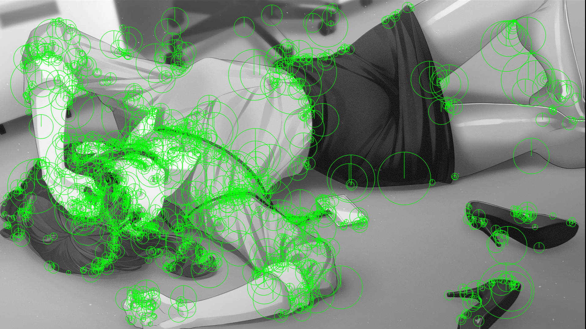

# 这是关于opencv特征检测的测试代码

由于部分原因，部分代码（主要是关于SIFT、SUFT算法）需要将opencv版本回退至3.4.1之前，python版本回退至3.6之前。

## 1、SIFT算法

sift算法核心是构建一个SIFT描述子，然后对图像进行描述，描述子是一个特征点的坐标和方向，描述子的大小是固定的，是128维的。
这些描述子是通过SIFT算法计算出来的，SIFT算法的计算过程是：
首先，我们需要计算出图像的特征点keypoint，这些特征点通过构建图像金字塔得出，这些特征点为图像以及差分金字塔的极值点。
然后，我们需要计算出每个特征点的描述子，这些描述子是一个128维的向量，描述子的大小是固定的，是128维的。

```python
        import cv2
        import numpy as np
        img=cv2.imread('test.jpg',0)
        sift=cv2.xfeatures2d.SIFT_create()
        kp,des=sift.detectAndCompute(img,None)
        img=cv2.drawKeypoints(img,kp,None,flags=cv2.DRAW_MATCHES_FLAGS_DRAW_RICH_KEYPOINTS)
        cv2.imshow('sift',img)
        cv2.waitKey(0)
        cv2.destroyAllWindows()
```

## 2、SURF算法

SUFT算法是sift算法的改进版，其计算量较SIFT算法较小。由于SIFT算法已申请专利，较高版本已将其移除。


